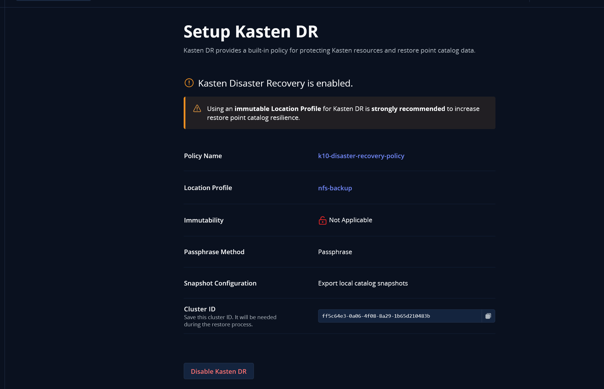
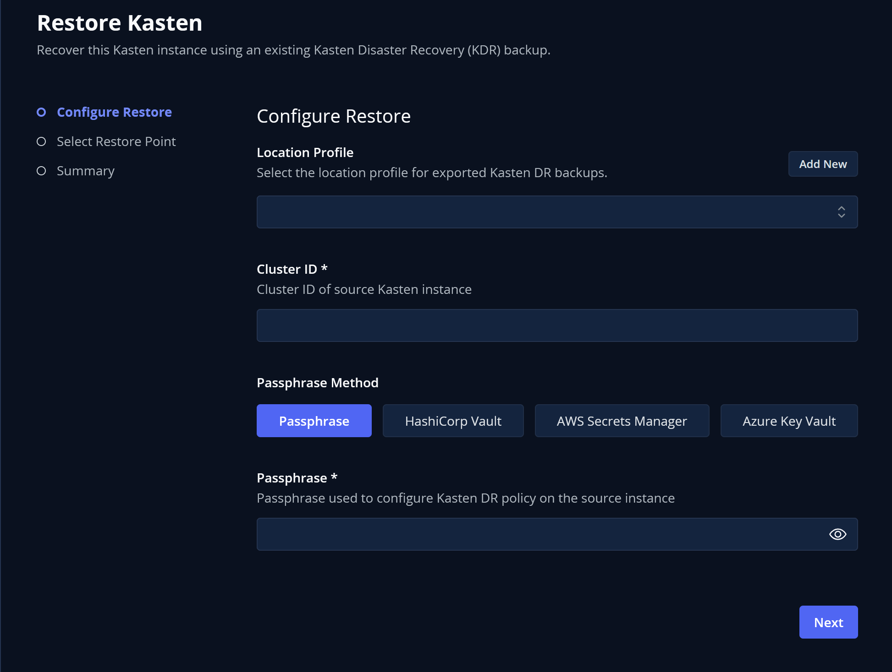
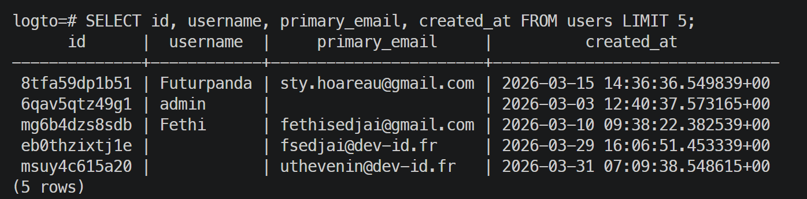

# Procédure de Restauration DR — Kasten K10

> **Objectif** : Restaurer l'ensemble des applications depuis le cluster **PROD** vers un cluster **DR** (Disaster Recovery) en utilisant les sauvegardes Kasten stockées sur le NAS.

---

## Architecture de référence

```
┌─────────────────────┐         ┌──────────────────────┐
│   Cluster PROD       │         │   NAS Synology        │
│                      │─ backup─▶  192.168.10.5         │
│  Kasten K10          │         │  /volume1/NFS_K8S_    │
│  Longhorn            │         │  DEVVER_BACKUP/       │
│  Traefik             │         │  pvc-54813501-...     │
└─────────────────────┘         └──────────┬───────────┘
                                            │
                                    restore │
                                            ▼
                                 ┌─────────────────────┐
                                 │   Cluster DR         │
                                 │                      │
                                 │  Kasten K10          │
                                 │  Longhorn            │
                                 │  Traefik             │
                                 └─────────────────────┘
```

---

## Prérequis sur le cluster DR

Avant de commencer la restauration, le cluster DR doit avoir :

- [ ] Kubernetes opérationnel (même version majeure que prod)
- [ ] **Longhorn** installé (StorageClass par défaut)
- [ ] **Traefik** installé (IngressClass `traefik`)
- [ ] **cert-manager** installé avec le ClusterIssuer `letsencrypt-cloudflare`
- [ ] **NFS CSI Driver** installé (`nfs.csi.k8s.io`)
- [ ] **Kasten K10** installé dans le namespace `kasten-io`
- [ ] Accès réseau au NAS `192.168.10.5` depuis les nodes DR

---

## ÉTAPE 1 — Côté PROD : s'assurer que le catalogue est sauvegardé

### 1.1 Vérifier la policy backup prod

La policy doit couvrir **tous les namespaces** avec export vers le Location Profile NFS.


> La policy doit inclure :
> - **Backup all namespaces** (ou au minimum les namespaces critiques)
> - **Export des PVC** activé
> - **Export du catalogue Kasten** activé

### 1.2 Vérifier que le catalogue Kasten est bien sauvegardé

Dans l'interface Kasten PROD → **Settings → Location Profiles**, confirmer que la policy exporte aussi le catalogue.



> Le catalogue contient les métadonnées de toutes les restorepoints — sans lui, impossible de lister les sauvegardes sur le cluster DR.

### 1.3 Récupérer le path exact du PVC de backup sur le NAS

```bash
# Sur le cluster PROD
kubectl get pvc pvc-kasten-backup -n kasten-io -o jsonpath='{.spec.volumeName}'
# → pv-kasten-backup (ou similaire)

kubectl get pv pv-kasten-backup -o jsonpath='{.spec.csi.volumeAttributes.share}'
# → /volume1/NFS_K8S_DEVVER_BACKUP

# Trouver le sous-dossier exact créé par Kasten (UID du PVC)
kubectl get pv pv-kasten-backup -o yaml | grep subPath
# ou vérifier directement sur le NAS : ls /volume1/NFS_K8S_DEVVER_BACKUP/
# → pvc-54813501-9114-44e4-b5e2-ab533af98ec8
```

> **NOTER CE PATH** — il sera utilisé dans le `pv-dr.yaml` à l'étape suivante.
> Exemple : `/volume1/NFS_K8S_DEVVER_BACKUP/pvc-54813501-9114-44e4-b5e2-ab533af98ec8`

---

## ÉTAPE 2 — Sur le cluster DR : monter les sauvegardes NFS

### 2.1 Appliquer la StorageClass NFS

```bash
kubectl apply -f nfs-backup-storageclass.yaml
```

Contenu (`nfs-backup-storageclass.yaml`) :
```yaml
apiVersion: storage.k8s.io/v1
kind: StorageClass
metadata:
  name: nfs-backup
provisioner: nfs.csi.k8s.io
parameters:
  server: 192.168.10.5
  share: /volume1/NFS_K8S_DEVVER_BACKUP
  onDelete: archive
mountOptions:
  - vers=3
  - nolock
reclaimPolicy: Delete
volumeBindingMode: Immediate
```

### 2.2 Créer le PV pointant vers le dossier de backup PROD

Éditer `pv-dr.yaml` avec le **path exact** noté à l'étape 1.3 :

```yaml
apiVersion: v1
kind: PersistentVolume
metadata:
  name: pv-kasten-backup-dr
spec:
  capacity:
    storage: 100Gi
  accessModes:
    - ReadWriteMany
  persistentVolumeReclaimPolicy: Retain
  storageClassName: nfs-backup
  mountOptions:
    - vers=3
    - nolock
  csi:
    driver: nfs.csi.k8s.io
    readOnly: false
    volumeHandle: kasten-backup-dr           # nom unique arbitraire
    volumeAttributes:
      server: 192.168.10.5
      share: /volume1/NFS_K8S_DEVVER_BACKUP/pvc-54813501-9114-44e4-b5e2-ab533af98ec8  # ← PATH PROD
  claimRef:
    namespace: kasten-io
    name: pvc-kasten-backup                  # nom fixe attendu par Kasten
```

```bash
kubectl apply -f pv-dr.yaml
```

### 2.3 Créer le PVC dans kasten-io

```bash
kubectl apply -f pvc-dr.yaml
```

Contenu (`pvc-dr.yaml`) :
```yaml
apiVersion: v1
kind: PersistentVolumeClaim
metadata:
  name: pvc-kasten-backup
  namespace: kasten-io
spec:
  storageClassName: nfs-backup
  accessModes:
    - ReadWriteMany
  resources:
    requests:
      storage: 100Gi
  volumeName: pv-kasten-backup-dr   # lié au PV ci-dessus
```

### 2.4 Vérifier que le PVC est bien Bound

```bash
kubectl get pvc pvc-kasten-backup -n kasten-io
# STATUS doit être : Bound
```

---

## ÉTAPE 3 — Configurer le Location Profile dans Kasten DR

### 3.1 Accéder à l'interface Kasten DR

```bash
# Port-forward si pas d'ingress configuré sur DR
kubectl port-forward svc/gateway -n kasten-io 8080:80
# → http://localhost:8080/k10/
```

### 3.2 Créer le Location Profile

1. Aller dans **Settings** → **Location Profiles** → **+ New Profile**
2. Choisir **File System**
3. Renseigner :
   - **Profile Name** : `nfs-backup-prod` (ou tout nom explicite)
   - **PVC** : `pvc-kasten-backup` (namespace `kasten-io`)
   - **Sub Path** : laisser vide (les données sont à la racine du share)

```bash
# Vérifier que Kasten voit bien le profil
kubectl get profile -n kasten-io
kubectl get profile -n kasten-io -o yaml | grep -A20 "fileSystem\|pvcName\|path\|subPath"
```

---

## ÉTAPE 4 — Importer le catalogue et lancer la restauration

### 4.1 Importer les RestorePoints depuis le catalogue

Dans l'interface Kasten DR :

1. **Policies** → **+ New Policy** → choisir **Import**
2. Sélectionner le **Location Profile** créé à l'étape 3
3. Kasten va scanner le NAS et importer les RestorePoints disponibles

> Si le catalogue a bien été sauvegardé côté PROD, tous les restorepoints apparaissent automatiquement.

### 4.2 Lancer la restauration



1. Aller dans **Applications** → sélectionner le namespace à restaurer
2. Cliquer sur **Restore**
3. Choisir le **RestorePoint** (par date)
4. Options importantes :
   - ✅ **Restore PVC** — restaure les volumes avec leurs données
   - ⚠️ **Ingress** — **DÉCOCHER** si les domaines sont différents entre prod et DR

---

## ÉTAPE 5 — Adaptations post-restauration

### 5.1 Adapter les Ingress pour le cluster DR

Les ingress sont restaurés avec les domaines PROD. Il faut les modifier ou les recréer.

```bash
# Lister les ingress restaurés
kubectl get ingress -A

# Éditer chaque ingress pour le bon domaine DR
kubectl edit ingress <nom-ingress> -n <namespace>
```

Exemple pour Kasten lui-même (`ingress.yaml`) — adapter le host :
```yaml
spec:
  rules:
  - host: kasten.dr.devver.app   # ← domaine DR au lieu de kasten.bk.devver.app
```

```bash
kubectl apply -f ingress.yaml
```

### 5.2 Adapter les variables d'environnement des applications

Certaines apps ont des env vars avec le domaine PROD hardcodé (ex: URLs de callback OAuth, URLs d'API).

```bash
# Lister les deployments dans le namespace restauré
kubectl get deploy -n <namespace>

# Voir les env vars d'un deployment
kubectl set env deploy/<nom-deploy> -n <namespace> --list

# Modifier une variable
kubectl set env deploy/<nom-deploy> -n <namespace> DOMAIN=dr.devver.app
```

> Exemple constaté avec **Logto** : les URLs de callback OIDC pointent vers le domaine prod.
> À modifier dans la config Logto ou via les env vars du déploiement.

### 5.3 Vérifier la remontée des PVC et données

```bash
# Vérifier que les PVC sont bien Bound sur Longhorn DR
kubectl get pvc -n <namespace>

# Vérifier que les pods sont Running
kubectl get pods -n <namespace>
```



> Validation : se connecter à l'application restaurée et vérifier que les données sont présentes.

---

## Récapitulatif des commandes DR

```bash
# 1. StorageClass NFS
kubectl apply -f nfs-backup-storageclass.yaml

# 2. PV pointant vers le backup PROD (modifier le share path avant)
kubectl apply -f pv-dr.yaml

# 3. PVC dans kasten-io
kubectl apply -f pvc-dr.yaml

# 4. Vérifier le bind
kubectl get pvc pvc-kasten-backup -n kasten-io

# 5. Configurer Location Profile dans l'UI Kasten, puis importer le catalogue

# 6. Restaurer via l'UI Kasten (sans les ingress)

# 7. Post-restore : adapter les ingress
kubectl apply -f ingress.yaml   # version modifiée pour le domaine DR

# 8. Vérifier tout
kubectl get pvc -A
kubectl get pods -A
kubectl get ingress -A
```

---

## Points d'attention et pièges connus

| Risque | Mitigation |
|--------|-----------|
| Path NFS incorrect dans `pv-dr.yaml` | Vérifier le path exact sur le NAS avant d'appliquer |
| PVC en `Pending` sur DR | Vérifier que le NFS CSI driver est installé et que le NAS est joignable |
| Ingress avec mauvais domaine | Toujours décocher la restauration des ingress et les recréer manuellement |
| Env vars pointant vers prod | Passer en revue chaque app restaurée et corriger les URLs |
| Catalogue non sauvegardé côté prod | S'assurer que la policy backup prod inclut l'export du catalogue Kasten |
| VolumeSnapshotClass manquante | Appliquer `volumestorageclass-longhorn.yaml` sur le cluster DR |

---

## Fichiers de ce dossier

| Fichier | Usage |
|---------|-------|
| `nfs-backup-storageclass.yaml` | StorageClass NFS (à appliquer sur PROD et DR) |
| `pvc-nfs-backup.yaml` | PVC de backup sur le cluster PROD |
| `pv-dr.yaml` | PV DR pointant vers le backup PROD sur le NAS |
| `pvc-dr.yaml` | PVC DR dans `kasten-io` pour Kasten |
| `volumestorageclass-longhorn.yaml` | VolumeSnapshotClass Longhorn pour Kasten |
| `ingress.yaml` | Ingress Kasten (à adapter selon le domaine DR) |
