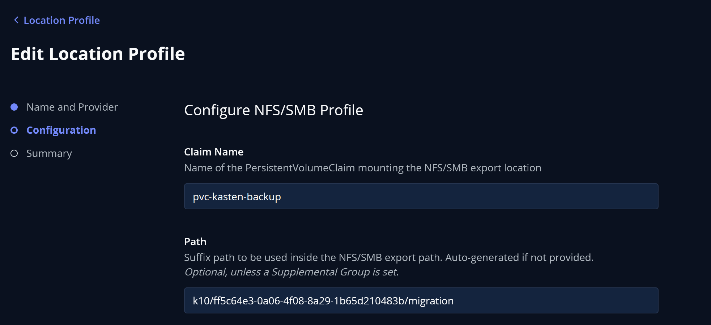

# Kasten K10 — Sauvegarde Kubernetes

[Kasten K10](https://www.kasten.io/) est une solution de backup/restore pour Kubernetes. Il protège les namespaces, volumes (PVC), et ressources Kubernetes via des policies de sauvegarde planifiées.

Interface accessible sur : **https://kasten.devver.app**

---

## Architecture de stockage

Tout le stockage Kasten repose sur `nfs-devver-prod` (NFS CSI) :

| Usage | StorageClass | PVC |
|---|---|---|
| Volumes temporaires kanister (copie de volumes) | `nfs-devver-prod` | générés dynamiquement |
| Location Profile (export des backups) | `nfs-backup` | `pvc-kasten-backup` (100Gi) |

---

## Composants de ce dossier

### `argo-app-kasten.yaml`
Application ArgoCD qui installe Kasten via Helm. Configure :
- `global.persistence.storageClass: nfs-devver-prod` — volumes internes Kasten sur NFS
- `kanister.backupPVCStorageClass: nfs-devver-prod` — copies de volumes temporaires sur NFS

### `nfs-backup-storageclass.yaml`
StorageClass pointant vers le partage de backup sur le NAS.

- Serveur NAS : `192.168.10.5`
- Share : `/volume1/NFS_K8S_DEVVER_BACKUP`
- NFS v3, `onDelete: archive` (les données ne sont pas supprimées si le PV est supprimé)

### `pvc-nfs-backup.yaml`
PVC utilisé par le Location Profile Kasten pour stocker les sauvegardes.
**Ne pas recréer** — le PV existant (`pvc-54813501`) pointe sur le sous-dossier NFS existant.

### `volumesnapshotclass-nfs.yaml`
VolumeSnapshotClass NFS avec l'annotation `k10.kasten.io/is-snapshot-class: "true"` pour que Kasten puisse déclencher des snapshots CSI.

### `ingress.yaml`
Expose l'interface Kasten via Traefik avec TLS Let's Encrypt (cert-manager).

---

## Ordre d'installation

```bash
# 1. Déployer Kasten via ArgoCD
kubectl apply -f argo-app-kasten.yaml

# 2. Attendre que Kasten soit prêt
kubectl wait --for=condition=ready pod -l app=k10 -n kasten-io --timeout=300s

# 3. Appliquer la VolumeSnapshotClass NFS
kubectl apply -f volumesnapshotclass-nfs.yaml

# 4. Appliquer la StorageClass de backup (si pas déjà présente)
kubectl apply -f nfs-backup-storageclass.yaml

# 5. Le PVC de backup existe déjà - vérifier qu'il est Bound
kubectl get pvc pvc-kasten-backup -n kasten-io

# 6. Appliquer l'ingress
kubectl apply -f ingress.yaml
```

> Le PVC `pvc-kasten-backup` (100Gi) est lié au PV `pvc-54813501-9114-44e4-b5e2-ab533af98ec8` qui pointe
> sur le sous-dossier NFS existant — les données de backup sont conservées sans recréation côté NAS.

---

## Configuration post-installation

Dans l'interface Kasten (`https://kasten.devver.app`) :

1. **Settings → Location Profiles → New Profile → File System**
   → indiquer le PVC `pvc-kasten-backup`

2. **Policies** → créer une policy par namespace avec :
   - Snapshot via `nfs-snapshot-class`
   - Export vers le Location Profile NFS


