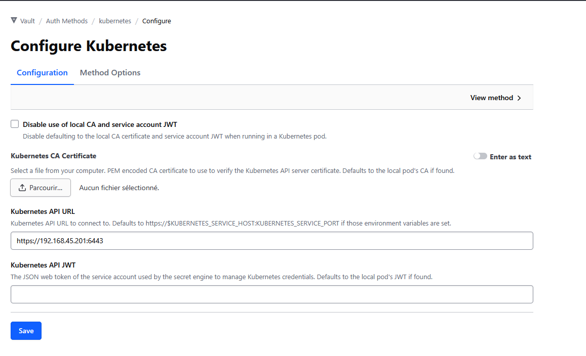

# Prérequis manuels : authentification Vault ↔ Kubernetes


## 1. Créer le Service Account vault-auth

```bash
kubectl apply -f kubernetes/vault/vault-auth-sa.yaml
kubectl apply -f kubernetes/vault/vault-auth-crb.yaml
```

Ce SA reçoit le droit de faire des `tokenreviews` et `subjectaccessreviews`  
— c'est le mécanisme que Vault utilise pour vérifier les tokens des pods.

---

## 2. Récupérer le JWT du SA vault-auth

```bash
kubectl get secret vault-auth-token -n kube-system \
  -o jsonpath='{.data.token}' | base64 -d
```

> Garder ce JWT : c'est la valeur `service_account_jwt` à fournir à Terraform.

---

## 3. Récupérer le CA certificate du cluster

```bash
kubectl config view --raw \
  --minify --flatten \
  -o jsonpath='{.clusters[].cluster.certificate-authority-data}' \
  | base64 -d
```

> Garder ce PEM : c'est la valeur `ca_cert` à fournir à Terraform.

---

Puis créer l'auth medtod kub dans le vault fais via UI



Tout cela just epour l'auth method


------


vault write auth/devver_k8s_prod/config \
  kubernetes_host="https://192.168.45.201:6443" \
  kubernetes_ca_cert=
-----END CERTIFICATE-----" \
  token_reviewer_jwt="" \
  disable_iss_validation=true